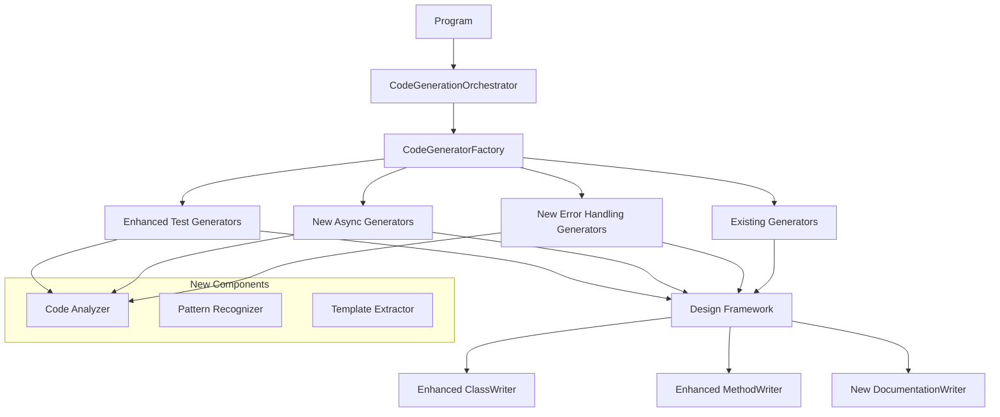

# Design Document

## Overview

The Core.CodeGen enhancement will transform the existing code generation system from a limited generator set to a comprehensive system that can analyze existing manually written code and automatically generate arity-based versions. The system will be enhanced with new generators for error handling, async operations, and comprehensive unit test generation, while improving the Design framework to support more complex code generation scenarios.

## Architecture

### Current Architecture Analysis

The existing Core.CodeGen follows a well-structured architecture with:
- **CodeGenerationOrchestrator**: Facade pattern coordinating the generation process
- **CodeGeneratorFactory**: Factory pattern creating appropriate generators
- **BaseCodeGenerator**: Template method pattern for consistent generation workflow
- **Design Framework**: Programmatic C# code writing system
- **Builders**: Specialized classes for constructing method implementations

### Enhanced Architecture

The enhanced system will extend this architecture with:

1. **Code Analysis Layer**: New component to analyze existing manual code
2. **Pattern Recognition System**: Identifies common patterns in existing code
3. **Enhanced Generators**: New generators for missing extension categories
4. **Improved Design Framework**: Enhanced to support complex method signatures
5. **Test Generation System**: Comprehensive unit test generation



## Components and Interfaces

### 1. Refactored Design Framework

#### Enhanced MethodWriter (Refactored)
The existing MethodWriter will be refactored to follow C# best practices:
- Immutable design with builder pattern for construction
- Proper encapsulation with readonly fields
- Support for generic method constraints with complex where clauses
- Extension method generation with proper `this` parameter handling
- XML documentation generation integrated into the writer

```csharp
// Refactored to be immutable and follow builder pattern
public sealed class MethodWriter : IMethodWriter
{
    private readonly string _name;
    private readonly string _returnType;
    private readonly string _body;
    private readonly Visibility _visibility;
    private readonly MethodModifier _modifier;
    private readonly IReadOnlyList<MethodParameter> _parameters;
    private readonly IReadOnlyList<GenericParameter> _genericParameters;
    private readonly IReadOnlyList<GenericConstraint> _genericConstraints; // New
    private readonly DocumentationWriter? _documentation; // Enhanced
    private readonly bool _isExtensionMethod; // New
    
    // Private constructor - use Builder
    private MethodWriter(MethodWriterBuilder builder) { /* ... */ }
    
    public static MethodWriterBuilder Create(string name, string returnType, string body) 
        => new(name, returnType, body);
}

// New builder for fluent API
public sealed class MethodWriterBuilder
{
    public MethodWriterBuilder WithExtensionMethod(string thisParameterType);
    public MethodWriterBuilder WithGenericConstraint(string parameterName, string constraint);
    public MethodWriterBuilder WithDocumentation(DocumentationWriter documentation);
    public MethodWriterBuilder WithAsyncModifier(bool isValueTask = false);
    public MethodWriter Build();
}
```

#### Enhanced DocumentationWriter
A new component following C# best practices for XML documentation:

```csharp
public sealed class DocumentationWriter
{
    private readonly string _summary;
    private readonly IReadOnlyDictionary<string, string> _parameters;
    private readonly string? _returns;
    private readonly IReadOnlyList<string> _typeParameters;
    private readonly IReadOnlyList<string> _exceptions;
    
    private DocumentationWriter(DocumentationBuilder builder) { /* ... */ }
    
    public static DocumentationBuilder Create(string summary) => new(summary);
    
    public void Write(IndentedTextWriter writer);
}

public sealed class DocumentationBuilder
{
    public DocumentationBuilder WithParameter(string name, string description);
    public DocumentationBuilder WithReturn(string description);
    public DocumentationBuilder WithTypeParameter(string name, string description);
    public DocumentationBuilder WithException<T>(string description) where T : Exception;
    public DocumentationWriter Build();
}
```

#### Refactored GenericParameter and New GenericConstraint
```csharp
// Enhanced existing GenericParameter
public sealed record GenericParameter(
    string Name, 
    string? Using = null, 
    IReadOnlyList<string>? Constraints = null);

// New constraint representation
public sealed record GenericConstraint(
    string ParameterName, 
    GenericConstraintType Type, 
    string? TypeName = null);

public enum GenericConstraintType
{
    Class,
    Struct,
    NotNull,
    Unmanaged,
    New,
    BaseClass,
    Interface
}
```

### 2. New Generator Categories

#### Error Handling Generators (Requirements 1.1-1.5)
Based on analysis of existing error handling extensions in `src/Core/Results/Extensions/ErrorHandling`:

- `ResultMapErrorExtensionsCodeGenerator` - Maps errors using transformation functions (Requirement 1.2)
- `ResultFilterErrorExtensionsCodeGenerator` - Filters errors based on predicates (Requirement 1.2)
- `ResultHasErrorExtensionsCodeGenerator` - Checks for specific error types (Requirement 1.2)
- `ResultHasExceptionExtensionsCodeGenerator` - Checks for specific exception types (Requirement 1.2)
- `ResultRecoveryExtensionsCodeGenerator` - Provides error recovery mechanisms (Requirement 1.2)
- `ResultAppendErrorExtensionsCodeGenerator` - Appends errors to existing results (Requirement 1.3)
- `ResultPrependErrorExtensionsCodeGenerator` - Prepends errors to existing results (Requirement 1.3)
- `ResultAccumulateExtensionsCodeGenerator` - Accumulates errors across operations (Requirement 1.3)
- `ResultFindErrorExtensionsCodeGenerator` - Finds specific errors in results (Requirement 1.4)
- `ResultMatchErrorExtensionsCodeGenerator` - Pattern matches on error types (Requirement 1.4)
- `ResultShapeErrorExtensionsCodeGenerator` - Transforms error structure (Requirement 1.5)

**Design Rationale**: Each generator focuses on a single error handling concern, following the single responsibility principle and making the system more maintainable and testable. This approach ensures complete coverage of all error handling extension methods identified in Requirement 1.


#### Async Generators (Requirements 3.1-3.5)
For Task and ValueTask variants found in `Tasks` and `ValueTasks` subdirectories:

- `ResultAsyncTransformationExtensionsCodeGenerator` - Async versions of Map, Bind, Then operations (Requirement 3.2)
- `ResultAsyncValidationExtensionsCodeGenerator` - Async versions of validation operations (Requirement 3.4)
- `ResultAsyncSideEffectExtensionsCodeGenerator` - Async versions of side-effect operations (Tap, Do) (Requirement 3.5)
- `ResultAsyncErrorHandlingExtensionsCodeGenerator` - Async versions of all error handling operations (Requirement 3.1)

**Design Rationale**: Async operations require careful handling of both Task and ValueTask variants, with proper async/await patterns and cancellation token support. This design ensures complete coverage of all async extension methods as specified in Requirement 3.

#### Additional Generator Categories (Requirements 6.3, 6.4)

- `ResultMatchExtensionsCodeGenerator` - Pattern matching extensions based on existing manual implementations (Requirement 6.3)
- `OptionExtensionsCodeGenerator` - Option type extensions based on existing manual implementations (Requirement 6.4)

**Design Rationale**: These generators ensure complete coverage of all existing manually written extension categories, providing consistency across the entire Core library as specified in Requirement 6.

### 3. Code Analysis System

#### Source Code Analysis Strategy (Requirements 1.1, 3.1, 4.1)

The system will analyze existing manually written code in specific directories:
- **Error Handling**: `src/Core/Results/Extensions/ErrorHandling` (Requirement 1.1)
- **Async Operations**: `src/Core/Results/Extensions/Tasks` and `src/Core/Results/Extensions/ValueTasks` (Requirement 3.1)
- **Unit Tests**: `test/Core.Tests` for extension methods (Requirement 4.1)

**Design Rationale**: By analyzing existing manual implementations, we ensure generated code maintains the same patterns, naming conventions, and behavior as hand-written code, providing seamless integration.

#### Refactored Pattern Analyzer (C# Best Practices)
Analyzes existing manual code to extract patterns:

```csharp
public sealed class PatternAnalyzer
{
    private readonly IFileReader _fileReader;
    private readonly ICodeParser _codeParser;
    
    public PatternAnalyzer(IFileReader fileReader, ICodeParser codeParser)
    {
        _fileReader = fileReader ?? throw new ArgumentNullException(nameof(fileReader));
        _codeParser = codeParser ?? throw new ArgumentNullException(nameof(codeParser));
    }
    
    // Analyzes specific directories based on requirements
    public async Task<IReadOnlyList<MethodPattern>> AnalyzeErrorHandlingExtensionsAsync(CancellationToken cancellationToken = default); // Requirement 1.1
    public async Task<IReadOnlyList<MethodPattern>> AnalyzeAsyncExtensionsAsync(CancellationToken cancellationToken = default); // Requirement 3.1
    public async Task<IReadOnlyList<TestMethodPattern>> AnalyzeExistingTestsAsync(CancellationToken cancellationToken = default); // Requirement 4.1
    
    public async Task<MethodPattern?> AnalyzeMethodAsync(string filePath, string methodName, CancellationToken cancellationToken = default);
    public async Task<IReadOnlyList<MethodPattern>> AnalyzeClassAsync(string filePath, CancellationToken cancellationToken = default);
    public GenerationTemplate ExtractTemplate(MethodPattern pattern);
}

// Immutable record following C# best practices
public sealed record MethodPattern(
    string Name,
    string ReturnType,
    IReadOnlyList<MethodParameter> Parameters,
    string Body,
    IReadOnlyList<GenericConstraint> Constraints,
    DocumentationInfo? Documentation = null,
    IReadOnlySet<string>? RequiredUsings = null,
    bool IsExtensionMethod = false,
    bool IsAsync = false,
    bool IsValueTask = false);

// New record for test pattern analysis (Requirements 4.4, 4.5)
public sealed record TestMethodPattern(
    string Name,
    string TestedMethodName,
    TestScenarioType ScenarioType,
    IReadOnlyList<string> ArrangeStatements,
    string ActStatement,
    IReadOnlyList<string> AssertStatements,
    IReadOnlySet<string> RequiredUsings,
    bool UsesXUnitAssertions = false);

public enum TestScenarioType
{
    Success,
    Failure,
    Exception,
    Validation,
    EdgeCase
}
```

#### Refactored Template Extractor
Converts analyzed patterns into generation templates:

```csharp
// Immutable template with validation
public sealed record GenerationTemplate(
    string MethodNamePattern,
    string ReturnTypePattern,
    string BodyTemplate,
    IReadOnlySet<string> RequiredUsings,
    DocumentationTemplate? Documentation = null)
{
    public GenerationTemplate
    {
        ArgumentException.ThrowIfNullOrWhiteSpace(MethodNamePattern);
        ArgumentException.ThrowIfNullOrWhiteSpace(ReturnTypePattern);
        ArgumentException.ThrowIfNullOrWhiteSpace(BodyTemplate);
        ArgumentNullException.ThrowIfNull(RequiredUsings);
    }
}

public sealed record DocumentationTemplate(
    string SummaryTemplate,
    IReadOnlyDictionary<string, string> ParameterTemplates,
    string? ReturnTemplate = null);
```

## Data Models

### Refactored Configuration (Following C# Best Practices)
```csharp
// Immutable configuration with builder pattern
public sealed record GenerationConfig(
    string BaseNamespace,
    ushort StartArity,
    string SubNamespace,
    string ClassName,
    FileOrganizationMode FileOrganization = FileOrganizationMode.SeparateFiles,
    bool GenerateDocumentation = true,
    bool GenerateAsyncVariants = true,
    bool GenerateTaskVariants = true,
    bool GenerateValueTaskVariants = true,
    string? SourceCodePath = null,
    IReadOnlySet<string>? ExcludedMethods = null)
{
    public static GenerationConfigBuilder Create(string baseNamespace, string className) 
        => new(baseNamespace, className);
}

public sealed class GenerationConfigBuilder
{
    public GenerationConfigBuilder WithSubNamespace(string subNamespace);
    public GenerationConfigBuilder WithStartArity(ushort startArity);
    public GenerationConfigBuilder WithFileOrganization(FileOrganizationMode mode);
    public GenerationConfigBuilder WithDocumentation(bool generate = true);
    public GenerationConfigBuilder WithAsyncVariants(bool generate = true);
    public GenerationConfigBuilder ExcludingMethods(params string[] methods);
    public GenerationConfig Build();
}
```

### Refactored Method Generation Context
```csharp
// Immutable context following C# best practices
public sealed record MethodGenerationContext(
    ushort Arity,
    string MethodName,
    string ReturnType,
    IReadOnlyList<MethodParameter> Parameters,
    string Body,
    DocumentationWriter? Documentation = null,
    bool IsAsync = false,
    bool IsValueTask = false,
    IReadOnlyList<GenericConstraint>? Constraints = null);
```

## Error Handling

### Refactored Error Handling (C# Best Practices)
All generators will implement consistent error handling following C# exception best practices:

```csharp
// Base exception following C# guidelines
public abstract class GenerationException : Exception
{
    protected GenerationException(string message) : base(message) { }
    protected GenerationException(string message, Exception innerException) : base(message, innerException) { }
    
    public abstract string GeneratorName { get; }
    public virtual string? SourceFile => null;
}

// Specific exception types
public sealed class ConfigurationException : GenerationException
{
    public ConfigurationException(string generatorName, string message) 
        : base($"Configuration error in {generatorName}: {message}") 
    {
        GeneratorName = generatorName;
    }
    
    public override string GeneratorName { get; }
}

public sealed class SourceAnalysisException : GenerationException
{
    public SourceAnalysisException(string generatorName, string sourceFile, string message, Exception? innerException = null)
        : base($"Analysis error in {generatorName} for file {sourceFile}: {message}", innerException)
    {
        GeneratorName = generatorName;
        SourceFile = sourceFile;
    }
    
    public override string GeneratorName { get; }
    public override string SourceFile { get; }
}

public sealed class TemplateException : GenerationException
{
    public TemplateException(string generatorName, string message, Exception? innerException = null)
        : base($"Template error in {generatorName}: {message}", innerException)
    {
        GeneratorName = generatorName;
    }
    
    public override string GeneratorName { get; }
}

public sealed class FileSystemException : GenerationException
{
    public FileSystemException(string generatorName, string filePath, string message, Exception? innerException = null)
        : base($"File system error in {generatorName} for {filePath}: {message}", innerException)
    {
        GeneratorName = generatorName;
        FilePath = filePath;
    }
    
    public override string GeneratorName { get; }
    public string FilePath { get; }
}
```

### Graceful Degradation
- If source code analysis fails, fall back to basic template generation
- If documentation generation fails, generate methods without documentation
- If async variant generation fails, generate only synchronous versions

## Testing Strategy

### Unit Test Generation Strategy

The system will analyze existing unit tests and generate arity-based versions:

1. **Test Pattern Analysis**: Analyze existing test methods to identify patterns
2. **Test Data Generation**: Generate appropriate test data for different arities
3. **Assertion Generation**: Use Core.XUnit patterns found in existing tests
4. **Test Organization**: Maintain same file structure as existing tests

#### Refactored Test Generator Architecture (C# Best Practices)
```csharp
public abstract class BaseTestGenerator : BaseCodeGenerator
{
    private readonly ITestAnalyzer _testAnalyzer;
    
    protected BaseTestGenerator(GenerationConfig config, ITestAnalyzer testAnalyzer) 
        : base(config)
    {
        _testAnalyzer = testAnalyzer ?? throw new ArgumentNullException(nameof(testAnalyzer));
    }
    
    protected abstract Task<TestClass> AnalyzeExistingTestsAsync(string testFilePath, CancellationToken cancellationToken = default);
    protected abstract IReadOnlyList<TestMethod> GenerateArityTests(TestMethod template, ushort arity);
    protected abstract string GenerateTestBody(TestMethod method, ushort arity);
}
```

#### Refactored Test Method Templates (Immutable Records)
```csharp
// Immutable test method template following C# best practices
public sealed record TestMethodTemplate(
    string Name,
    TestType Type,
    IReadOnlyList<string> ArrangeStatements,
    string ActStatement,
    IReadOnlyList<string> AssertStatements,
    IReadOnlySet<string> RequiredUsings)
{
    public TestMethodTemplate
    {
        ArgumentException.ThrowIfNullOrWhiteSpace(Name);
        ArgumentException.ThrowIfNullOrWhiteSpace(ActStatement);
        ArgumentNullException.ThrowIfNull(ArrangeStatements);
        ArgumentNullException.ThrowIfNull(AssertStatements);
        ArgumentNullException.ThrowIfNull(RequiredUsings);
    }
}

public enum TestType
{
    Success,
    Failure,
    Exception,
    Validation
}

// Builder for complex test method construction
public sealed class TestMethodTemplateBuilder
{
    public TestMethodTemplateBuilder WithName(string name);
    public TestMethodTemplateBuilder WithType(TestType type);
    public TestMethodTemplateBuilder AddArrangeStatement(string statement);
    public TestMethodTemplateBuilder WithActStatement(string statement);
    public TestMethodTemplateBuilder AddAssertStatement(string statement);
    public TestMethodTemplateBuilder AddUsing(string @using);
    public TestMethodTemplate Build();
}
```

### Generated Test Structure
Tests will follow the existing patterns:
- **Arrange**: Set up test data with appropriate arity
- **Act**: Execute the method under test
- **Assert**: Verify results using Core.XUnit extensions

Example generated test:
```csharp
[Fact]
public void MapError_WithValidMapper_Arity3_ReturnsTransformedErrors()
{
    // Arrange
    var error1 = new TestError("Error 1");
    var error2 = new TestError("Error 2");
    var result = Result.Failure<string, int, bool>(error1, error2);
    var mapper = (IEnumerable<IError> errors) => errors.Select(e => new MappedError(e.Message));
    
    // Act
    var mappedResult = result.MapError(mapper);
    
    // Assert
    mappedResult.Should().BeFailure()
        .And.HaveErrorsCount(2)
        .And.HaveError<MappedError>();
}
```

### Integration Testing
- Test complete generation workflow
- Verify generated code compiles
- Verify generated tests pass
- Performance testing for large arity ranges

### Validation Testing
- Verify all existing manual code has generated equivalents
- Verify generated code maintains same behavior as manual code
- Verify generated documentation is accurate and complete

## Migration Strategy and Test Validation

### Manual Code Replacement Strategy

**Design Rationale**: The system must safely replace manually written code with generated equivalents while ensuring no functionality is lost and all tests continue to pass.

#### Pre-Generation Validation
1. **Existing Test Execution**: Run all existing unit tests to establish baseline
2. **Code Coverage Analysis**: Ensure all manually written methods have corresponding tests
3. **API Surface Documentation**: Document all existing public APIs that must be preserved

#### Generation and Validation Process
1. **Generate New Code**: Create arity-based versions using analyzed patterns
2. **Parallel Validation**: Keep both manual and generated code temporarily
3. **Test Execution**: Run existing tests against generated code
4. **Behavioral Verification**: Ensure generated code produces identical results

#### Manual Code Removal Process
1. **Incremental Replacement**: Replace manual code category by category
2. **Test Validation**: All existing unit tests must pass before removing manual code
3. **Manual Code Backup**: Before removing any manually written code, rename all existing *.cs files to *.cs.backup to preserve the original implementations
4. **Generated Test Creation**: Only create generated unit tests after manual code removal
5. **Final Validation**: Run complete test suite with only generated code

```csharp
public sealed class MigrationOrchestrator
{
    private readonly ITestRunner _testRunner;
    private readonly ICodeAnalyzer _codeAnalyzer;
    private readonly ICodeGenerator _codeGenerator;
    
    public async Task<MigrationResult> ExecuteMigrationAsync(MigrationConfiguration config)
    {
        // Phase 1: Validate existing code and tests
        var baselineResult = await _testRunner.RunAllTestsAsync();
        if (!baselineResult.AllPassed)
            throw new MigrationException("Existing tests must pass before migration");
        
        // Phase 2: Generate new code alongside existing
        var generatedCode = await _codeGenerator.GenerateAllAsync(config);
        
        // Phase 3: Validate generated code against existing tests
        var validationResult = await ValidateGeneratedCodeAsync(generatedCode);
        if (!validationResult.AllTestsPassed)
            throw new MigrationException("Generated code must pass all existing tests");
        
        // Phase 4: Remove manual code incrementally
        await RemoveManualCodeIncrementallyAsync(config.CategoriesToMigrate);
        
        // Phase 5: Generate unit tests for generated code
        await GenerateUnitTestsAsync(generatedCode);
        
        // Phase 6: Final validation
        var finalResult = await _testRunner.RunAllTestsAsync();
        return new MigrationResult(finalResult.AllPassed, finalResult.TestResults);
    }
    
    private async Task<ValidationResult> ValidateGeneratedCodeAsync(GeneratedCodeSet generatedCode)
    {
        // Run existing tests against generated code to ensure behavioral equivalence
        return await _testRunner.RunTestsAgainstGeneratedCodeAsync(generatedCode);
    }
    
    private async Task RemoveManualCodeIncrementallyAsync(IReadOnlyList<string> categories)
    {
        foreach (var category in categories)
        {
            await RemoveManualCodeForCategoryAsync(category);
            
            // Validate tests still pass after each category removal
            var testResult = await _testRunner.RunAllTestsAsync();
            if (!testResult.AllPassed)
                throw new MigrationException($"Tests failed after removing manual code for category: {category}");
        }
    }
    
    private async Task GenerateUnitTestsAsync(GeneratedCodeSet generatedCode)
    {
        // Only generate unit tests after manual code has been successfully removed
        // and all existing tests pass with generated code
        await _codeGenerator.GenerateUnitTestsAsync(generatedCode);
    }
}

public sealed record MigrationConfiguration(
    IReadOnlyList<string> CategoriesToMigrate,
    bool ValidateTestsBeforeRemoval = true,
    bool GenerateTestsAfterMigration = true,
    string BackupDirectory = "migration-backup");

public sealed record MigrationResult(
    bool Success,
    IReadOnlyList<TestResult> FinalTestResults,
    IReadOnlyList<string> MigratedCategories = null,
    IReadOnlyList<string> FailedCategories = null);
```

## Implementation Phases

### Phase 0: Pre-Migration Validation (Critical First Step)
1. **Baseline Test Execution**: Run all existing unit tests to ensure they pass
2. **Code Coverage Analysis**: Verify all manual methods have corresponding tests
3. **API Documentation**: Document all existing public APIs for preservation
4. **Backup Creation**: Create backup of all manual code before generation

### Phase 1: Refactor Design Framework (Small, Focused Functions)
1. **Refactor MethodWriter**: Split into small, single-purpose methods
   - `WriteMethodSignature()` - handles signature generation only
   - `WriteGenericConstraints()` - handles where clauses only  
   - `WriteMethodBody()` - handles body indentation and formatting
   - `WriteDocumentation()` - handles XML doc generation only
2. **Refactor ClassWriter**: Break down large Write() method
   - `WriteClassDeclaration()` - class signature only
   - `WriteMembers()` - delegates to specific member writers
   - `WriteRegions()` - handles region organization only
3. **Create IndentationManager**: Dedicated class for proper code indentation
   - `IncreaseIndent()` - manages indentation levels
   - `WriteIndentedLine()` - ensures proper line indentation
   - `WriteIndentedBlock()` - handles block indentation

### Phase 2: Code Analysis System (Focused, Single-Purpose Classes)
1. **FileAnalyzer**: Single responsibility - file reading and parsing
   - `ReadSourceFile()` - reads file content only
   - `ParseMethods()` - extracts method definitions only
   - `ExtractDocumentation()` - extracts XML docs only
2. **PatternExtractor**: Single responsibility - pattern identification
   - `IdentifyMethodPattern()` - identifies single method pattern
   - `ExtractParameterPattern()` - extracts parameter patterns only
   - `ExtractBodyPattern()` - extracts method body patterns only
3. **TemplateBuilder**: Single responsibility - template creation
   - `BuildMethodTemplate()` - creates method templates only
   - `BuildDocumentationTemplate()` - creates doc templates only

### Phase 3: Error Handling Generators (One Generator Per Extension)
1. **MapErrorGenerator**: Generates only MapError extensions
   - `GenerateBasicMapError()` - basic overload only
   - `GenerateMapErrorWithPolicy()` - policy overload only
   - `GenerateAsyncMapError()` - async variants only
2. **HasErrorGenerator**: Generates only HasError extensions
   - `GenerateGenericHasError()` - generic type checking only
   - `GenerateExceptionHasError()` - exception checking only
3. **FilterErrorGenerator**: Generates only FilterError extensions
4. **RecoveryGenerator**: Generates only Recovery extensions
5. Each generator follows single responsibility principle

### Phase 4: Async Generators (Focused Scope)
1. **AsyncWrapperGenerator**: Wraps sync methods in async variants
   - `WrapInTask()` - creates Task variants only
   - `WrapInValueTask()` - creates ValueTask variants only
2. **AsyncTransformationGenerator**: Generates async transformation extensions
3. **AsyncValidationGenerator**: Generates async validation extensions
4. **AsyncSideEffectGenerator**: Generates async side-effect extensions

### Phase 5: Manual Code Removal and Validation
1. **IncrementalRemovalOrchestrator**: Manages safe removal of manual code
   - `RemoveCategoryCode()` - removes one category at a time
   - `ValidateTestsAfterRemoval()` - ensures tests still pass
   - `RollbackOnFailure()` - restores manual code if tests fail
2. **TestValidationRunner**: Validates existing tests against generated code
   - `RunExistingTestsAgainstGenerated()` - validates behavioral equivalence
   - `CompareTestResults()` - ensures identical test outcomes
   - `ReportValidationIssues()` - identifies any behavioral differences

### Phase 6: Test Generation System (Only After Manual Code Removal)
1. **TestMethodAnalyzer**: Analyzes existing test methods (for pattern extraction)
   - `ExtractArrangeSection()` - extracts arrange code only
   - `ExtractActSection()` - extracts act code only  
   - `ExtractAssertSection()` - extracts assert code only
2. **TestDataGenerator**: Generates test data for new arity-based tests
   - `GenerateSuccessData()` - success scenario data only
   - `GenerateFailureData()` - failure scenario data only
3. **TestAssertionBuilder**: Builds test assertions for generated methods
   - `BuildSuccessAssertion()` - success assertions only
   - `BuildFailureAssertion()` - failure assertions only

**Important**: Test generation only occurs AFTER manual code has been successfully removed and all existing tests pass with generated code.

### Phase 7: Integration and Code Quality
1. **IndentationValidator**: Ensures proper code formatting
   - `ValidateMethodIndentation()` - checks method formatting
   - `ValidateClassIndentation()` - checks class formatting
2. **CodeQualityChecker**: Validates generated code quality
   - `CheckMethodLength()` - ensures methods are short
   - `CheckSingleResponsibility()` - validates single purpose
3. **IntegrationOrchestrator**: Coordinates all generators
   - `RunSingleGenerator()` - runs one generator at a time
   - `ValidateOutput()` - validates single generator output

## Configuration and Extensibility

### Enhanced Configuration System (Requirements 7.1-7.5)

**Design Rationale**: The configuration system must support extensibility, validation, and different generation modes while maintaining type safety and clear error reporting.

```csharp
// Immutable configuration with comprehensive validation (Requirement 7.5)
public sealed record CodeGenerationConfiguration(
    string BaseNamespace,
    string SourceDirectory,
    string TestDirectory,
    ushort TargetArity,
    FileOrganizationMode FileOrganization = FileOrganizationMode.SeparateFiles,
    bool GenerateDocumentation = true,
    bool GenerateAsyncVariants = true,
    bool GenerateTaskVariants = true,
    bool GenerateValueTaskVariants = true,
    bool GenerateTests = true,
    IReadOnlySet<string>? EnabledCategories = null,
    IReadOnlyDictionary<string, ushort>? CategorySpecificArities = null, // Requirement 7.3
    IReadOnlyDictionary<string, string>? NamespaceCustomizations = null, // Requirement 7.4
    IReadOnlyDictionary<string, object>? GeneratorSettings = null)
{
    // Comprehensive validation (Requirement 7.5)
    public CodeGenerationConfiguration
    {
        ArgumentException.ThrowIfNullOrWhiteSpace(BaseNamespace);
        ArgumentException.ThrowIfNullOrWhiteSpace(SourceDirectory);
        ArgumentException.ThrowIfNullOrWhiteSpace(TestDirectory);
        ArgumentOutOfRangeException.ThrowIfZero(TargetArity);
        
        if (TargetArity > 8)
            throw new ArgumentOutOfRangeException(nameof(TargetArity), "Target arity cannot exceed 8");
            
        if (!Directory.Exists(SourceDirectory))
            throw new DirectoryNotFoundException($"Source directory not found: {SourceDirectory}");
            
        if (!Directory.Exists(TestDirectory))
            throw new DirectoryNotFoundException($"Test directory not found: {TestDirectory}");
    }
    
    public static CodeGenerationConfigurationBuilder Create(
        string baseNamespace, 
        string sourceDirectory, 
        string testDirectory, 
        ushort targetArity) => new(baseNamespace, sourceDirectory, testDirectory, targetArity);
}

public sealed class CodeGenerationConfigurationBuilder
{
    public CodeGenerationConfigurationBuilder WithFileOrganization(FileOrganizationMode mode); // Requirement 7.2
    public CodeGenerationConfigurationBuilder WithDocumentation(bool generate = true);
    public CodeGenerationConfigurationBuilder WithAsyncVariants(bool generateTask = true, bool generateValueTask = true);
    public CodeGenerationConfigurationBuilder WithTests(bool generate = true);
    public CodeGenerationConfigurationBuilder EnableCategories(params string[] categories);
    public CodeGenerationConfigurationBuilder WithCategoryArity(string category, ushort arity); // Requirement 7.3
    public CodeGenerationConfigurationBuilder WithNamespaceCustomization(string category, string @namespace); // Requirement 7.4
    public CodeGenerationConfigurationBuilder WithGeneratorSetting<T>(string key, T value);
    public CodeGenerationConfiguration Build();
}

// Enhanced file organization modes (Requirement 7.2)
public enum FileOrganizationMode
{
    SeparateFiles,           // Each generator creates separate files
    SingleFileWithRegions,   // All generators write to single file with regions
    CategoryBasedFiles,      // Group by category (ErrorHandling, Collections, etc.)
    ArityBasedFiles         // Group by arity level
}
```

### Enhanced Generator Registration System (Requirement 7.1)

**Design Rationale**: The registration system must support dynamic generator discovery, category-based filtering, and proper dependency injection while maintaining type safety.

```csharp
public static class CodeGeneratorFactory
{
    private static readonly ConcurrentDictionary<string, GeneratorRegistration> _generators = new();
    
    // Enhanced registration with metadata (Requirement 7.1)
    public static void RegisterGenerator<T>(
        string category, 
        Func<CodeGenerationConfiguration, T> factory,
        GeneratorMetadata? metadata = null) 
        where T : class, ICodeGenerator
    {
        ArgumentException.ThrowIfNullOrWhiteSpace(category);
        ArgumentNullException.ThrowIfNull(factory);
        
        var registration = new GeneratorRegistration(
            category,
            typeof(T),
            config => factory(config),
            metadata ?? GeneratorMetadata.Default);
            
        _generators.TryAdd(category, registration);
    }
    
    // Support for all existing manually written extension categories (Requirement 6.1-6.5)
    public static void RegisterAllCoreGenerators()
    {
        // Error Handling Generators (Requirement 6.1)
        RegisterGenerator("MapError", config => new ResultMapErrorExtensionsCodeGenerator(config));
        RegisterGenerator("FilterError", config => new ResultFilterErrorExtensionsCodeGenerator(config));
        RegisterGenerator("HasError", config => new ResultHasErrorExtensionsCodeGenerator(config));
        RegisterGenerator("HasException", config => new ResultHasExceptionExtensionsCodeGenerator(config));
        RegisterGenerator("Recovery", config => new ResultRecoveryExtensionsCodeGenerator(config));
        RegisterGenerator("AppendError", config => new ResultAppendErrorExtensionsCodeGenerator(config));
        RegisterGenerator("PrependError", config => new ResultPrependErrorExtensionsCodeGenerator(config));
        RegisterGenerator("AccumulateError", config => new ResultAccumulateExtensionsCodeGenerator(config));
        RegisterGenerator("FindError", config => new ResultFindErrorExtensionsCodeGenerator(config));
        RegisterGenerator("MatchError", config => new ResultMatchErrorExtensionsCodeGenerator(config));
        RegisterGenerator("ShapeError", config => new ResultShapeErrorExtensionsCodeGenerator(config));
        
        // Async Generators (Requirement 6.2)
        RegisterGenerator("AsyncTransformation", config => new ResultAsyncTransformationExtensionsCodeGenerator(config));
        RegisterGenerator("AsyncValidation", config => new ResultAsyncValidationExtensionsCodeGenerator(config));
        RegisterGenerator("AsyncSideEffect", config => new ResultAsyncSideEffectExtensionsCodeGenerator(config));
        RegisterGenerator("AsyncErrorHandling", config => new ResultAsyncErrorHandlingExtensionsCodeGenerator(config));
        
        // Additional Categories (Requirements 6.3, 6.4)
        RegisterGenerator("ResultMatch", config => new ResultMatchExtensionsCodeGenerator(config));
        RegisterGenerator("Option", config => new OptionExtensionsCodeGenerator(config));
        
        // Test Generators (Requirements 4.1-4.5)
        RegisterGenerator("ErrorHandlingTests", config => new ErrorHandlingTestGenerator(config));
        RegisterGenerator("AsyncTests", config => new AsyncTestGenerator(config));
    }
    
    public static IReadOnlyList<ICodeGenerator> CreateGenerators(CodeGenerationConfiguration config)
    {
        ArgumentNullException.ThrowIfNull(config);
        
        var enabledCategories = config.EnabledCategories ?? GetAllCategories();
        var generators = new List<ICodeGenerator>();
        
        foreach (var category in enabledCategories)
        {
            if (_generators.TryGetValue(category, out var registration))
            {
                try
                {
                    var generator = registration.Factory(config);
                    generators.Add(generator);
                }
                catch (Exception ex)
                {
                    throw new ConfigurationException(category, $"Failed to create generator: {ex.Message}", ex);
                }
            }
            else
            {
                throw new ConfigurationException(category, $"Unknown generator category: {category}");
            }
        }
        
        return generators.AsReadOnly();
    }
    
    public static IReadOnlySet<string> GetAllCategories() => _generators.Keys.ToHashSet();
    
    public static GeneratorMetadata? GetGeneratorMetadata(string category) =>
        _generators.TryGetValue(category, out var registration) ? registration.Metadata : null;
}

// Supporting types for enhanced registration
public sealed record GeneratorRegistration(
    string Category,
    Type GeneratorType,
    Func<CodeGenerationConfiguration, ICodeGenerator> Factory,
    GeneratorMetadata Metadata);

public sealed record GeneratorMetadata(
    string Description,
    IReadOnlySet<string> RequiredSourceDirectories,
    IReadOnlySet<string> SupportedFileOrganizationModes,
    bool SupportsAsyncGeneration = true,
    bool SupportsTestGeneration = true)
{
    public static GeneratorMetadata Default => new(
        "Standard generator",
        new HashSet<string>(),
        Enum.GetNames<FileOrganizationMode>().ToHashSet());
}
```

## API Consistency and Quality Assurance (Requirement 8)

### Consistent API Patterns (Requirements 8.1-8.5)

**Design Rationale**: Ensuring predictable and consistent APIs across all generated methods is crucial for developer experience and maintainability.

#### Parameter Naming Consistency (Requirement 8.1)
- **Result Parameters**: Always named `result` for the primary Result parameter
- **Function Parameters**: Named by purpose (`mapper`, `predicate`, `selector`, `action`)
- **Generic Type Parameters**: Follow T1, T2, T3... pattern consistently
- **Error Parameters**: Named `error` for single errors, `errors` for collections

#### Return Type Patterns (Requirement 8.2)
- **Transformation Methods**: Return Result<TNew1, TNew2, ...> with same arity
- **Validation Methods**: Return same Result<T1, T2, ...> type as input
- **Collection Methods**: Return Result<IEnumerable<T1>, IEnumerable<T2>, ...>
- **Async Methods**: Wrap return types in Task<> or ValueTask<> consistently

#### Error Handling Consistency (Requirement 8.3)
- **Null Checks**: All public methods validate non-null parameters
- **Exception Types**: Use ArgumentNullException for null parameters
- **Error Propagation**: Failed results always propagate through the chain
- **Error Context**: Preserve original error context in transformations

#### Documentation Standards (Requirement 8.4)
- **Summary**: Clear, concise description of method purpose
- **Type Parameters**: Document ALL generic type parameters exhaustively, including both error types (TError) and value types (TValue1, TValue2, etc.) with descriptive ordinal names (first, second, third, etc.)
- **Parameters**: Document all method parameters with purpose
- **Returns**: Document return value and conditions
- **Exceptions**: Document thrown exceptions (except for unit tests)
- **Completeness**: Documentation must be exhaustive - no generic type parameter should be left undocumented

#### Async Naming Conventions (Requirement 8.5)
- **Async Suffix**: All async methods end with "Async" (e.g., `MapErrorAsync`)
- **Task vs ValueTask**: Consistent naming regardless of return type
- **Overloads**: Async overloads maintain same base name with Async suffix
- **CancellationToken**: Always last parameter when present

### Code Quality and Organization Principles

#### Function Size and Scope
- **Maximum Method Length**: 20 lines of code (excluding braces and whitespace)
- **Single Responsibility**: Each method performs exactly one well-defined task
- **Clear Naming**: Method names clearly indicate their single purpose
- **No Side Effects**: Methods that return values don't modify state

#### Code Organization
- **Logical Grouping**: Related methods grouped in same class
- **Dependency Injection**: Dependencies injected via constructor
- **Immutable Design**: Prefer immutable objects where possible
- **Builder Pattern**: For complex object construction

#### Generated Code Quality
- **Proper Indentation**: All generated code properly indented (4 spaces per level)
- **Consistent Formatting**: Consistent brace placement and spacing
- **Clear Structure**: Logical organization of generated methods
- **Documentation**: All public methods have XML documentation (except unit tests)

### API Consistency Validation System

```csharp
public sealed class ApiConsistencyValidator
{
    public ValidationResult ValidateGeneratedMethods(IReadOnlyList<MethodWriter> methods)
    {
        var issues = new List<ValidationIssue>();
        
        // Validate parameter naming consistency (Requirement 8.1)
        issues.AddRange(ValidateParameterNaming(methods));
        
        // Validate return type patterns (Requirement 8.2)
        issues.AddRange(ValidateReturnTypePatterns(methods));
        
        // Validate async naming conventions (Requirement 8.5)
        issues.AddRange(ValidateAsyncNaming(methods));
        
        // Validate documentation completeness (Requirement 8.4)
        issues.AddRange(ValidateDocumentation(methods));
        
        return new ValidationResult(issues);
    }
    
    private IEnumerable<ValidationIssue> ValidateParameterNaming(IReadOnlyList<MethodWriter> methods)
    {
        // Implementation validates consistent parameter naming across methods
        yield break;
    }
    
    private IEnumerable<ValidationIssue> ValidateReturnTypePatterns(IReadOnlyList<MethodWriter> methods)
    {
        // Implementation validates consistent return type patterns
        yield break;
    }
    
    private IEnumerable<ValidationIssue> ValidateAsyncNaming(IReadOnlyList<MethodWriter> methods)
    {
        // Implementation validates async method naming conventions
        yield break;
    }
    
    private IEnumerable<ValidationIssue> ValidateDocumentation(IReadOnlyList<MethodWriter> methods)
    {
        // Implementation validates documentation completeness
        yield break;
    }
}

public sealed record ValidationResult(IReadOnlyList<ValidationIssue> Issues)
{
    public bool IsValid => Issues.Count == 0;
    public IReadOnlyList<ValidationIssue> Errors => Issues.Where(i => i.Severity == ValidationSeverity.Error).ToList();
    public IReadOnlyList<ValidationIssue> Warnings => Issues.Where(i => i.Severity == ValidationSeverity.Warning).ToList();
}

public sealed record ValidationIssue(
    ValidationSeverity Severity,
    string Category,
    string Message,
    string? MethodName = null,
    string? ParameterName = null);

public enum ValidationSeverity
{
    Warning,
    Error
}
```

### Example of Well-Structured Generated Code

```csharp
/// <summary>
/// Maps errors in the result using the specified mapping function.
/// </summary>
/// <typeparam name="T1">The type of the first value.</typeparam>
/// <typeparam name="T2">The type of the second value.</typeparam>
/// <param name="result">The result to map errors for.</param>
/// <param name="mapError">The function to map errors.</param>
/// <returns>A new result with mapped errors if the original result failed.</returns>
/// <exception cref="ArgumentNullException">Thrown when <paramref name="result"/> or <paramref name="mapError"/> is null.</exception>
public static Result<T1, T2> MapError<T1, T2>(
    this Result<T1, T2> result,
    Func<IEnumerable<IError>, IEnumerable<IError>> mapError)
    where T1 : notnull
    where T2 : notnull
{
    ArgumentNullException.ThrowIfNull(result);
    ArgumentNullException.ThrowIfNull(mapError);
    
    return result.Match(
        Result.Success,
        errors => Result.Failure<T1, T2>(mapError(errors))
    );
}

/// <summary>
/// Asynchronously maps errors in the result using the specified mapping function.
/// </summary>
/// <typeparam name="T1">The type of the first value.</typeparam>
/// <typeparam name="T2">The type of the second value.</typeparam>
/// <param name="resultTask">The task containing the result to map errors for.</param>
/// <param name="mapError">The function to map errors.</param>
/// <param name="cancellationToken">The cancellation token.</param>
/// <returns>A task containing a new result with mapped errors if the original result failed.</returns>
/// <exception cref="ArgumentNullException">Thrown when <paramref name="resultTask"/> or <paramref name="mapError"/> is null.</exception>
public static async Task<Result<T1, T2>> MapErrorAsync<T1, T2>(
    this Task<Result<T1, T2>> resultTask,
    Func<IEnumerable<IError>, IEnumerable<IError>> mapError,
    CancellationToken cancellationToken = default)
    where T1 : notnull
    where T2 : notnull
{
    ArgumentNullException.ThrowIfNull(resultTask);
    ArgumentNullException.ThrowIfNull(mapError);
    
    var result = await resultTask.ConfigureAwait(false);
    return result.MapError(mapError);
}
```

This design provides a comprehensive enhancement to the Core.CodeGen system that will analyze existing manual code and generate consistent, well-documented, and thoroughly tested arity-based versions across all extension categories, ensuring complete coverage of all requirements while maintaining high code quality and API consistency.